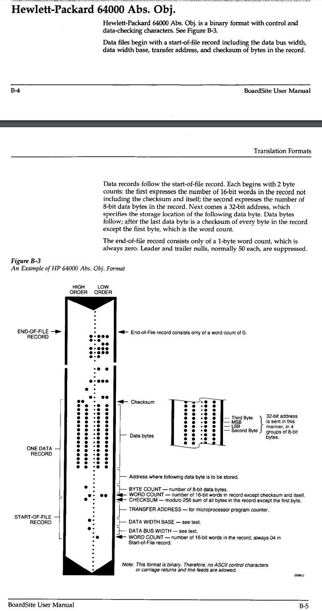

### hp64000 abs obj format 

Format is:
* start-of-file record
* some number of data records
* end-of-file record

#### start-of-file record
Data file begins with start-of-file record. 

| Size in bytes | Value       | Meaning                                                                                              |
|---------------|-------------|------------------------------------------------------------------------------------------------------|
| 1?            | 4 (always)  | word count - # of 16-bit words in record (w/o checksum and this byte itself  , so 8 bytes = 4 words) |
| 2             | ?           | data bus width                                                                                       |
| 2             | ?           | data width base                                                                                      |
| 4             | ?           | transfer address                                                                                     |
| 1             | (calculated) | checksum : modulo 256 sum of all bytes in record except the first byte                               |

#### data record
Each data record is build like following description:

| Size in bytes | Value        | Meaning                                                                                              |
|---------------|--------------|------------------------------------------------------------------------------------------------------|
| 1?            | (calculated)            | word count - # of 16-bit words in record (w/o checksum and this byte itself  , so 8 bytes = 4 words) |
| 2             | (calculated)            | byte count - # of 8-bit data bytes                                                                   |
| 4             | ?            | address where following data is to be stored                                                         |
| n             | ?            | n data bytes                                                                                         |
| 1             | (calculated) | checksum : modulo 256 sum of all bytes in record except the first byte                               |

#### End-of-file record

| Size in bytes | Value      | Meaning                                          |
|---------------|------------|--------------------------------------------------|
| 1?            | 0 (always) | End-of-file record has word count 0 |

Order of bytes in 32-bit addresses:

| Offset in file | Meaning  |
|----------------|----------|
| 0              | 2nd byte |
| 1              | LSB      |
| 2              | MSB      |
| 3              | 3rd byte |

To be constructed 32 bit value:
 MSB.3rd.2nd.LSB

From Promac manual additional infos on the format:
- eight address bits (4 bytes)
- data bus width = data word width = 8
- understand no end-of-file record (???, manual page 28)

So start-of-file looks like this:

| Size in bytes | Value        | Meaning                                                                                              |
|---------------|--------------|------------------------------------------------------------------------------------------------------|
| 1?            | 4 (always)   | word count - # of 16-bit words in record (w/o checksum and this byte itself  , so 8 bytes = 4 words) |
| 2             | 8            | data bus width                                                                                       |
| 2             | 8            | data width base                                                                                      |
| 4             | ?            | transfer address                                                                                     |
| 1             | (calculated) | checksum : modulo 256 sum of all bytes in record except the first byte                               |

File format infos were taken from some other eprom programmer manual:

