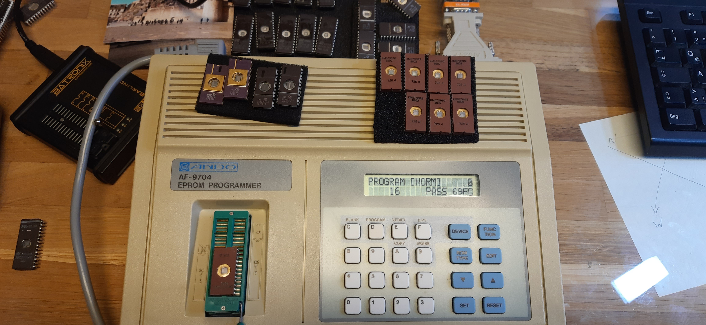
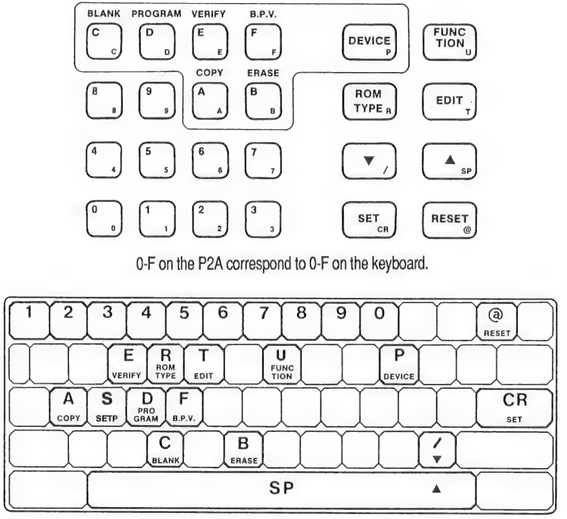

## AndoPromacUI
Control of vintage Eprommer via textual UI.
Eprommer is accessed via serial cable and a serial<->USB adapter.



Eprommer can be controlled (e.g. the key functions are supported)
and EPROM data can be uploaded and downloaded.

Support for following EPROM Programmers:
* ANDO AF-9704 
* Promac Model 2A 

All tests were made with Ando AF-9704. The Promac Model 2A is 99-100% equal to 
the Ando AF-9704 and should behave the same :-)

## Build
```shell
go build .
```
will create the executable AndoPromacUI.

## Use
```shell
./AndoPromacUI
```

Execution without any arguments will use defaults and prints out some debug info:
```shell
% ./AndoPromacUI 
Ando/Promac EPROM Programmer Communication UI
--device, TTY Device: /dev/ttyUSB0
--dry-run: false
--debug: 0
--baudrate: 19200
--outfile: out-<checksum>.bin
--batch: false (batch mode not yet supported)
--infile: in.bin
Commands:
 @              - RESET
 P A <CR>       - DEVICE-COPY
 P C <CR>       - DEVICE-BLANK
 P D <CR>       - DEVICE-PROGRAM
 P E <CR>       - DEVICE-VERIFY
 U 9 <CR>       - Quit REMOTE CONTROL
 U 6 <CR>       - Send data to EPrommer
 U 7 <CR>       - Receive Data from EPrommer
 U 8 <CR>       - VERIFY
 R <SPACE> <CR> - outputs selected ROM-TYPE
 U 5 <SPACE> <CR> - outputs currently selected Data Format
 U 5 <NUMBER> <CR> - Selected Data Format (Examples: 5=ASCII-Hex, A=HP64000ABS)
Compound Commands:
 : q            - Quit Ando/Promac EPROM Programmer Communication UI
 : d            - Download EPROM data (like U7)
 : w            - Write EPROM data to file out-<checksum>.bin
 : u            - Upload EPROM data from file in.bin to EPrommer
 : f            - Change file transfer format (ASCII-Hex, HP64000ABS, GENERIC). Current is: HP64000ABS

Command >  [:qdwuf] > 
```
All possible commands can be entered on command line, for a list of commands check the 
programmers manual. A few of the commands have been implemented as "Compound Commands"
in the app, to make download/upload easier.

Mapping of command keys and keys on computer keyboard:


During download from EPrommer, a checksum is calculated from all bytes downloaded.
This is an uint32 sum of all byte values in EPROM. The checksum is being used for the
filename for saved EPROM data.
The last 4 digits of the checksum should be identical to checksum from Ando AF-9704
programmer, which is shown after DEVICE->COPY on its display.

## Cable connections required
I am using a simple USB<->Serial adapter. See what additional adaptors I've used to have 
it working.


## Some info on transfer file format
Ando EPrommer supports many formats for up- and downloading.

This software only supports:
* ASCII-Hex for up- and download
* HP64000ABS-OBJ for downloading (this a binary format)
* (GENERIC for debugging transfer data)

Download time for 4K EPROM is ~8.5 seconds with ASCII-Hex and ~3.5 seconds with HP64000ABS.

Some more details on file formats see [file-formats.md](file-formats.md)

## Different firmwares
On my original Ando device there was firmware 21.7. 
Later I've raised this to a Promac 21.9 firmware. This firmware behaves slightly different in up/download.
Software was tested for firmware 21.9.

## Restrictions
The software uses package "golang.org/x/term" and was only tested with Linux.
I do not know if that package exists for other operating systems,
So software might only run on Linux.

## Further reading
* [JMC Promac Model 2A Programmer Manual](docs/jmc-promac-2a-ep-programmer-manual.pdf)